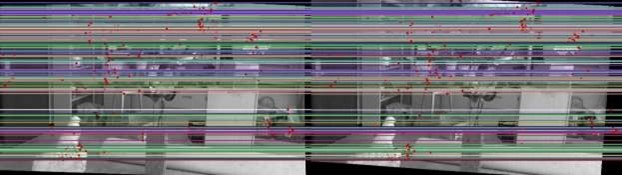
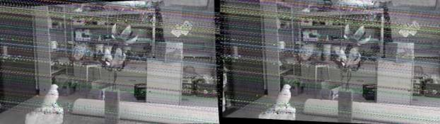
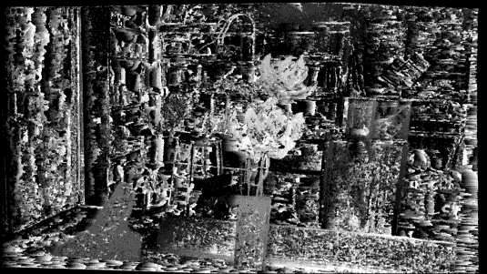
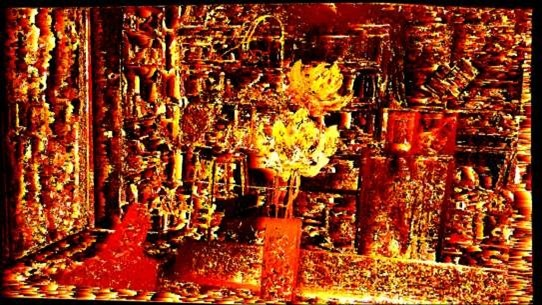
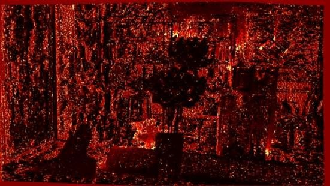

# Stereo Vision System and 3D Reconstruction README

## Libraries Required

Make sure to have the following libraries installed before running the code:

- `opencv`: For image processing and computer vision tasks.
- `numpy`: For numerical operations and matrix manipulations.
- `random`: For generating random numbers (used in some algorithms for randomness).
- `matplotlib.pyplot`: For plotting and visualizing data.

## General Instructions

Run the corresponding code in the terminal for each part of the project. There are three Python files provided, one for each dataset. Remember to change the path for the images in the code to the directories on your system where the datasets are stored.

## Part 1: Fundamental and Essential Matrices

### Terminal Outputs

The following matrices will be printed in the terminal:
1. Fundamental Matrix (F)
2. Essential Matrix (E)
3. Rotation Matrix (R)
4. Translation Matrix (T)

### Visual Outputs

The following feature details will be displayed in a separate window:
1. Detected Features in the images
2. Matched Features between the two images

## Part 2: Image Rectification and Epipolar Lines

### Terminal Outputs

Printed Homography matrices for image rectification:
1. Homography for left image (H1)
2. Homography for right image (H2)

### Visual Outputs

Displayed epipolar lines:
1. Epilines before rectification on the images

2. Epilines after rectification on the images

## Part 3: Disparity Map Calculation

### Visual Outputs

Displayed disparity maps:
1. Disparity map in grayscale

2. Disparity map using a heatmap for visualization

## Part 4: Depth Map Computation

### Visual Outputs

Displayed depth information:
1. Depth map in grayscale
2. Depth map using a heatmap for visualization

## Additional Notes

- The disparity calculation can be time-consuming; please be patient as the process completes.
- The source codes and the detailed PDF report are included within the zip file submission.

